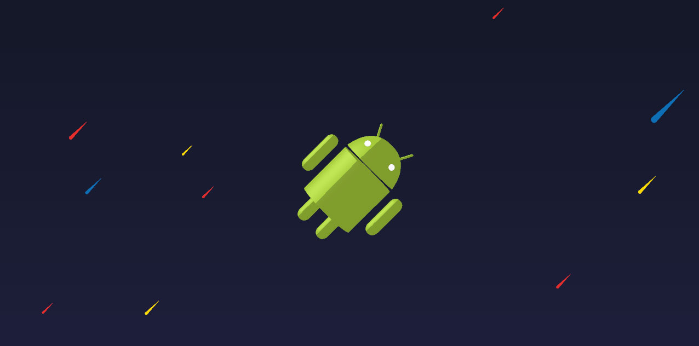

# Tutorial: Using three.js and anime.js to make Tell Me When My Chromebook Gets Play Store



The code for the [tutorial at ryannjohnson.github.io](https://ryannjohnson.github.io/tutorial-chromebookplaystore-webgl/).

## Compile

Run the following in your terminal:

```bash
$ npm install
$ npm run build
$ npm run server
```

You can then navigate to <http://127.0.0.1:8080/> or whatever addresses your terminal displays.

### Development

The `package.json` file contains some scripts for watching changes to files. To automatically compile changes to the Javascript files, open up a new terminal and run:

```bash
$ npm run watch-js
```
