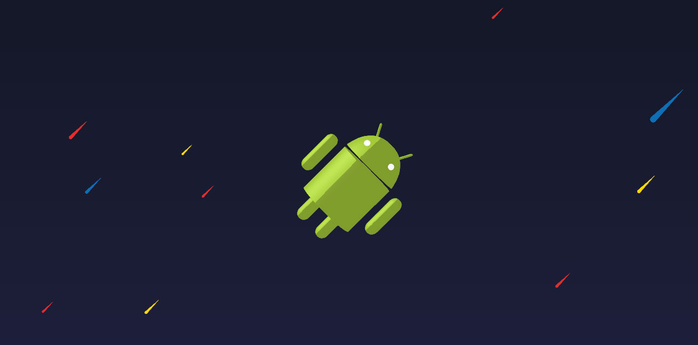

Earlier this month, I made and launched a [website for telling people when their Chromebook would get the Play Store][chromebookplaystore]. It's a niche notification service that only benefits a subset of Chromebook owners, scraping a [single webpage](https://sites.google.com/a/chromium.org/dev/chromium-os/chrome-os-systems-supporting-android-apps) for changes and emailing them to relevant users. The idea is pretty straightforward.

This tutorial will walk through how to make its featured 3D Android animation using [anime.js][animejs] and [three.js][threejs]. By the end, you will have created a simple webpage with the following interactive animation:

<video controls>
  <source type="video/mp4" src="content/08-android-chromeorites.mp4">
  <a href="content/08-android-chromeorites.mp4">Video of the android being animated with the mouse.</a>
</video>

Alternatively, you're welcome to [follow along on Github][github] following each commit's diff of code added and removed.

## Getting started

For this tutorial, make sure you have the following installed:

 - [node and npm](https://nodejs.org/en/download/)
 - [git](https://git-scm.com/downloads)

Open up your command-line, `cd` to the project directory you'd like to work in, and run the following:

```bash
$ git clone https://github.com/ryannjohnson/tutorial-chromebookplaystore-webgl
$ cd tutorial-chromebookplaystore-webgl
$ git reset --hard bbefdcddcf452e891b55c6e5bbb915d09e238272
```

This will result in a boilerplate directory tree:

```
.
├── .babelrc
├── .editorconfig
├── .gitignore
├── .nvmrc
├── package.json
├── public
│   └── assets
│       ├── android.json
│       └── dist
│           └── .gitignore
├── README.md
├── resources
│   ├── blender
│   │   └── android.blend
│   └── js
│       └── app.js
└── webpack.config.js
```

With this, we can install our dependencies and build our Javascript files.

```bash
$ npm install
$ npm run build
$ npm run watch-js
```

This last command will be long-running. As with most long-running processes, hold `ctrl` and press `c` to stop it.

Unfortunately, there's nothing for us to look at in the browser yet. Let's change that.

## Starting with the HTML

This project assumes that the `public/` folder is the root of our website, so we'll start with our HTML in `public/index.html`. Let's make that file.

```bash
$ touch public/index.html
```

Open it up and insert the following code:

```html
<!DOCTYPE html>
<html lang="en">
  <head>
    <meta charset="UTF-8">
    <meta name="viewport" content="width=device-width, initial-scale=1.0">

    <!--
    These are all the CSS styles we'll need for the project.
    -->
    <style>
      html,
      body {
        min-height: 100%;
        margin: 0;
        padding: 0;
        height: 100%;
        font-size: 100%;
        font-family: sans-serif; }
      body {
        background: #111622;
        background: -moz-linear-gradient(top, #111622 0%, #212040 100%);
        background: -webkit-gradient(linear, left top, left bottom, color-stop(0%, #111622), color-stop(100%, #212040));
        background: -webkit-linear-gradient(top, #111622 0%, #212040 100%);
        background: -o-linear-gradient(top, #111622 0%, #212040 100%);
        background: -ms-linear-gradient(top, #111622 0%, #212040 100%);
        background: linear-gradient(to bottom, #111622 0%, #212040 100%);
        filter: progid:DXImageTransform.Microsoft.gradient(startColorstr='#111622', endColorstr='#212040', GradientType=1); }
      body.no-js:before {
        display: inline-block;
        position: absolute;
        top: 50%;
        left: 50%;
        -moz-transform: translateX(-50%) translateY(-50%);
        -o-transform: translateX(-50%) translateY(-50%);
        -ms-transform: translateX(-50%) translateY(-50%);
        -webkit-transform: translateX(-50%) translateY(-50%);
        transform: translateX(-50%) translateY(-50%);
        content: 'You must enable Javascript to continue.';
        padding: 20px;
        font-size: 14px;
        color: white;
        background: rgba(0, 0, 0, 0.1);
        border: 1px solid rgba(255, 255, 255, 0.1);
        text-align: center;
        width: 66%; }
        @media screen and (min-width: 768px) {
          body.no-js:before {
            width: auto; } }
      .space-droid {
        position: absolute;
        top: 0;
        left: 0;
        right: 0;
        bottom: 0;
        overflow: hidden;
        z-index: 0; }
      .space-droid__canvas {
        position: relative; }
    </style>

  </head>
  <body class="no-js">

    <!--
    Assuming that the user's browser is executing Javascript, this
    script will remove the `no-js` class from the `<body>` element. If
    Javascript doesn't fire, then our CSS rules will show a savvy
    warning message to the user.
    -->
    <script id="no-js-script">document.body.className='';document.body.removeChild(document.getElementById('no-js-script'));</script>

    <!--
    Our animation will be attached to this DOM element. By matter of
    preference, we'll use the `id` attribute to select this element from
    Javascript, and we'll use the `class` attribute for its CSS rules.
    -->
    <div id="space-droid" class="space-droid"></div>

    <!--
    This file gets generated when `npm run build` and `npm run watch-js`
    are executed. This is the code that will inject our animation into
    the HTML.
    -->
    <script src="assets/dist/js/app.js"></script>

  </body>
</html>
```

This HTML document has everything we need to inject our WebGL scene into. We won't need to touch it again during this tutorial.

While you can open up `public/index.html` directly in your browser at this stage, a CORS error will be thrown later when we load other assets from the server. Instead, you should open up a new terminal, navigate to the project root, run `npm run server`, and browse to the ip address it gives you.

You should see a blank page with a deep purple background with `hello world` written in the console.


That's good! That means the Javascript compiled correctly and we're able to see our progress as we move forward.

## Creating the WebGL scene

If we open up `resources/js/app.js`, we'll see the "hello world" `console.log` call.

```js
// resources/js/app.js

console.log("hello world");
```

The Javascript isn't doing much right now, but we'll come back to this in a moment. Instead, we're going to create the code for our 3D scene in a new file.

```bash
$ touch resources/js/scene.js
```

Open `resources/js/scene.js` and paste the following code:

```js
// resources/js/scene.js

const THREE = require('three');


export class SpaceDroidScene {

  /**
   * @param {DOM Element} element
   */
  constructor(element) {

    // We will use this reference to manipulate the DOM.
    this.rootElement = element;

    // Setup the WebGL scene.
    this.scene = new THREE.Scene();

    // Our camera points towards the origin straight-on.
    const aspectRatio = element.offsetWidth / element.offsetHeight;
    this.camera = new THREE.PerspectiveCamera(35, aspectRatio, 0.1, 1000);
    this.camera.position.set(0, 0, 35);
    this.camera.lookAt(new THREE.Vector3(0, 0, 0));
    this.scene.add(this.camera);

    // Our key light is at a 3/4 angle from our subject.
    this.directionalLight = new THREE.DirectionalLight(0xffffff, .75);
    this.directionalLight.position.set(-1, 1, 0);
    this.scene.add(this.directionalLight);

    // Our fill light normalizes the colors, making white 100% white.
    this.ambientLight = new THREE.AmbientLight(0xffffff, 0.25);
    this.scene.add(this.ambientLight);

    // Inject to the DOM.
    this.renderer = new THREE.WebGLRenderer({ antialias: true, alpha: true });
    this.renderer.setSize(element.offsetWidth, element.offsetHeight);
    this.renderer.domElement.className = 'space-droid__canvas';
    this.renderer.domElement.style.opacity = 1;
    element.appendChild(this.renderer.domElement);

    // Sample box to fill our scene.
    const geometry = new THREE.BoxBufferGeometry(10, 10, 10);
    const material = new THREE.MeshLambertMaterial({ color: 0x00ffbb });
    this.sampleMesh = new THREE.Mesh(geometry, material);
    this.sampleMesh.position.set(0, 0, 0);
    this.sampleMesh.rotation.set(0, 0, 0);
    this.scene.add(this.sampleMesh);

    // Our scene is fully loaded.
    this.onLoad();

  }

  onLoad() {

    // Render a single frame.
    this.renderer.render(this.scene, this.camera);

  }

}
```

There's a lot going on here, so let's break down the steps it's taking.

 - Create a brand new [three.js][threejs] scene and add a camera, 2 lights, and geometry to it.
 - Instantiate our WebGL canvas and attach it to the DOM.
 - Render a single frame.

The above scene creation is analogous to opening a new file in Blender with its default properties only slightly adjusted.


Our code isn't loaded yet, so we won't see anything new in our browser.

This is where we now need `resources/js/app.js`. This file will become our "glue" between our animation code and the browser window. All we'll do here is import our scene and attach it to the DOM. By keeping the animation separate from any DOM element in particular, we will be free to instantiate this animation wherever we please (and as many times as we please).

Let's insert the glue code into `resources/js/app.js`, replacing the existing `console.log('hello world');`.

```js
// resources/js/app.js

import { SpaceDroidScene } from './scene';


const element = document.getElementById('space-droid');
if (element) {
  window.spaceDroidScene = new SpaceDroidScene(element);
}

```

Now if you refresh your browser, you'll see a cube has appeared.


We've officially generated a 3D image in the browser! Play around with the `this.sampleMesh.rotation.set(X, Y, Z);` numbers, refresh, and watch how the cube renders at different angles. _(Hint: rotation is measured in radians.)_

This is also a good time to lookup all the three.js objects we're instantiating and what arguments they take. The [three.js documentation][threejsdocs] is a great resource and will help you understand the power you have over this scene.

 - [THREE.Scene](https://threejs.org/docs/#api/scenes/Scene)
 - [THREE.PerspectiveCamera](https://threejs.org/docs/#api/cameras/PerspectiveCamera)
 - [THREE.Vector3](https://threejs.org/docs/#api/math/Vector3)
 - [THREE.DirectionalLight](https://threejs.org/docs/#api/lights/DirectionalLight)
 - [THREE.AmbientLight](https://threejs.org/docs/#api/lights/AmbientLight)
 - [THREE.WebGLRenderer](https://threejs.org/docs/#api/renderers/WebGLRenderer)
 - [THREE.BoxBufferGeometry](https://threejs.org/docs/#api/geometries/BoxTHREE.BufferGeometry)
 - [THREE.MeshLambertMaterial](https://threejs.org/docs/#api/materials/MesTHREE.hLambertMaterial)
 - [THREE.Mesh](https://threejs.org/docs/#api/objects/Mesh)

## Adding the Android 3D model

Rendering a cube is alright, but we _really_ want to add our own geometry and materials to the scene. In this case, we want to load our Android model.

Three.js's default way of doing this is by requesting each asset individually from the server. This means we can store our `android.json` file separately from our Javascript. This could be a huge advantage if we had so many assets that we wanted to show a loading page in the meantime.

I made my own Android model in [Blender][blender] and saved it as `resources/blender/android.blend`.


You might have noticed how blocky the model is. This is OK for now; we're going to let three.js smooth it out in our code.

_NOTE: If you'd like to produce a `.json` file compatible with three.js, I'd recommend using the [blender three.js export plugin](https://github.com/mrdoob/three.js/tree/master/utils/exporters/blender). If you're having trouble with its output, switch the `Type` setting to `Geometry` instead of `Buffergeometry`._

To implement this model, open up `resources/js/scene.js` and replace its contents with the following:

```js
// resources/js/scene.js

const THREE = window.THREE = require('three');
require('../../node_modules/three/examples/js/modifiers/SubdivisionModifier');


export class SpaceDroidScene {

  /**
   * @param {DOM Element} element
   */
  constructor(element) {

    // We will use this reference to manipulate the DOM.
    this.rootElement = element;

    // Setup the WebGL scene.
    this.scene = new THREE.Scene();

    // Our camera points towards the origin straight-on.
    const aspectRatio = element.offsetWidth / element.offsetHeight;
    this.camera = new THREE.PerspectiveCamera(35, aspectRatio, 0.1, 1000);
    this.camera.position.set(0, 0, 35);
    this.camera.lookAt(new THREE.Vector3(0, 0, 0));
    this.scene.add(this.camera);

    // Our key light is at a 3/4 angle from our subject.
    this.directionalLight = new THREE.DirectionalLight(0xffffff, .75);
    this.directionalLight.position.set(-1, 1, 0);
    this.scene.add(this.directionalLight);

    // Our fill light normalizes the colors, making white 100% white.
    this.ambientLight = new THREE.AmbientLight(0xffffff, 0.25);
    this.scene.add(this.ambientLight);

    // Inject to the DOM.
    this.renderer = new THREE.WebGLRenderer({ antialias: true, alpha: true });
    this.renderer.setSize(element.offsetWidth, element.offsetHeight);
    this.renderer.domElement.className = 'space-droid__canvas';
    this.renderer.domElement.style.opacity = 1;
    element.appendChild(this.renderer.domElement);

    // When loading external assets, this will help us know when
    // everything is loaded.
    this.loadingManager = new THREE.LoadingManager();
    this.loadingManager.onLoad = this.onLoad.bind(this);

    // Load the Android model by fetching it from the server.
    const loader = new THREE.ObjectLoader(this.loadingManager);
    loader.load("assets/android.json", object => {

      // Save a reference to the loaded android model.
      this.android = object;

      // Make materials here in three.js.
      const bodyMaterial = new THREE.MeshToonMaterial({
        color: new THREE.Color(0xa4ca39),
        shading: THREE.SmoothShading,
        shininess: 15,
      });
      const eyeMaterial = new THREE.MeshToonMaterial({
        color: new THREE.Color(0xffffff),
        emissive: new THREE.Color(0x333333),
        shading: THREE.SmoothShading,
      });

      // Will make our blocky model smooth by creating more verticies.
      // This is exactly how Blender would do it, except that it would
      // make `android.json` exponentially larger to download.
      const subdivider = new THREE.SubdivisionModifier(2);

      // Apply materials and subdivision to every piece of geometry
      // within the loaded model.
      for (let mesh of this.android.children) {
        subdivider.modify(mesh.geometry);
        switch(mesh.material.name) {

          // These names are what they were called in Blender prior to
          // export. We'll use them now to identify what their materials
          // should be.
          case 'lambert2SG':
            mesh.material = bodyMaterial;
            break;
          case 'lambert3SG':
            mesh.material = eyeMaterial;
            break;

        }
      }

      // Nest our android inside a new object so we can manipulate an
      // extra set of axes while the android spins on its own axes.
      this.androidGroup = new THREE.Object3D();
      this.androidGroup.position.set(0, -1, -200);
      this.androidGroup.rotation.set(deg(5), 0, deg(-45));
      this.androidGroup.add(this.android);
      this.android.position.set(0, -10, 0);
      this.android.rotation.set(Math.PI, 0, 0);
      this.scene.add(this.androidGroup);

    });

  }

  /**
   * Called once when all the assets are finished loading.
   */
  onLoad() {

    // Render a single frame.
    this.renderer.render(this.scene, this.camera);

  }

}


/**
 * Helper to convert degrees to radians.
 */
function deg(degrees) {
  return Math.PI * degrees / 180;
}

```

We've added two main things in this iteration:

 1. Instead of making our cube, we're importing our android and processing it when it loads.
 2. We're adding a `THREE.LoadingManager` and letting it call our `onLoad` method when our Android is loaded and processed.

Refresh your browser and behold the Android model, turned at a 45 degree angle.


Again, play round with the parameters in `resources/js/scene.js`. See how our Android changes perspective when you tweak the `this.android.rotation` properties or when you add in another light or change the materials. You have an incredible amount of control over this single rendered frame.

## Adding animation

The three.js library's only purpose is to render a single image through WebGL. It inherently contains no concept of time or motion.

The phenomenon of animation is merely a sequence of still images shown in quick succession, just enough to trick the human brain into interpreting it as motion. In other words, we're going to tell three.js to render lots of frames very quickly!

In the `resources/js/scene.js` file, we're going to add `animejs` at the top and replace the `SpaceDroidScene.onLoad` method with something new:

```js
// resources/js/scene.js

import anime from 'animejs';

/* ...imports, etc... */

class SpaceDroidScene {

  /* ...constructor, etc... */

  /**
   * Called once when all the assets are finished loading.
   */
  onLoad() {

    // Establish a new subset of properties.
    this.android.custom = {
      rotationSpeed: .002,
    }

    /**
     * Called on every frame refresh (up to 60 fps on most screens).
     *
     * @param {number} timestamp - Milliseconds since page has loaded.
     * @return {void}
     */
    const renderFrame = function(timestamp) {

      // Like setTimeout, but waits for the next available browser
      // repaint.
      requestAnimationFrame(renderFrame);

      // Change the Android's local rotation by some fixed increment
      // every frame. Be aware that frames aren't always rendered for
      // various reasons (window is minimized), so it'll pick up
      // wherever it left off on the next render.
      this.android.rotation.y += parseFloat(this.android.custom.rotationSpeed);

      // Render the new frame.
      this.renderer.render(this.scene, this.camera);

    }.bind(this);

    // Set an animejs timeline for the body of the android. Animejs
    // changes values in relation to real-time, so even if some frames
    // aren't rendered in time, animejs will act as if they were and
    // skip ahead.
    anime({
      targets: this.androidGroup.position,
      z: 0,
      easing: 'easeInOutQuart',
      loop: true,
      direction: 'alternate',
      duration: 10000,
    });

    // It's important to render the first frame inside a
    // requestAnimationFrame call in order to avoid some startup lag.
    requestAnimationFrame(renderFrame);

  }

}

/* ...helpers, etc... */

```

This gives us a moving Android! It spins on one axis and cycles to and from the camera.

<video controls>
  <source type="video/mp4" src="content/06-android-animated.mp4">
  <a href="content/06-android-animated.mp4">Video of the android being animated.</a>
</video>

For the cycling, we used [anime.js][animejs] for the first time. It has a [thorough documentation](http://animejs.com/documentation/) and a pleasantly simple single-object interface. It won't take long to understand it enough to put it to good use.

Tinker around with `this.android.custom.rotationSpeed` or other `this.android` properties. See what you can make the Android do. With just these tools, it's even possible to program a lengthy, complex timeline of intertwined actions.

## Adding interaction

Currently, our animation follows a predictable course, one that will execute every time the page is reloaded. Instead of pre-determining what the Android does, we can let user input influence how it moves.

To illustrate this, we're going to add a simple "turbo" button that speeds up our Android's spinning when clicked and slows it back down when released.

Let's make a new method in our `resources/js/scene.js` file for the turbo animation.

```js
// resources/js/scene.js

/* ...imports, etc... */

class SpaceDroidScene {

  /* ...constructor, onLoad, etc... */

  /**
   * Fires when the user says so.
   */
  setTurbo(isEnabled) {
    anime.remove(this.android.custom);
    anime({
      targets: this.android.custom,
      rotationSpeed: isEnabled ? 0.1 : 0.002,
      easing: 'linear',
      duration: 1000,
    });
  }

}

/* ...helpers, etc... */

```

Already, you could open your console, run `spaceDroidScene.setTurbo(1)` and get results. Instead, it might be more fun to add a button to the DOM.

We will do this in our glue file, since the animation shouldn't know anything about the implementation of the button in the DOM. Replace the contents of `resources/js/app.js` with the following:

```js
// resources/js/app.js

import { SpaceDroidScene } from './scene';


const element = document.getElementById('space-droid');
if (element) {
  window.spaceDroidScene = new SpaceDroidScene(element);

  // Make our button for the turbo mode.
  const button = document.createElement('button');
  button.style.position = 'relative';
  button.style.zIndex = 10;
  button.textContent = 'Turbo';
  button.addEventListener('mousedown', e => {
    window.spaceDroidScene.setTurbo(1);
  });
  button.addEventListener('mouseup', e => {
    window.spaceDroidScene.setTurbo(0);
  });
  document.body.appendChild(button);

}
```

Now we can toggle turbo by clicking a button on the screen interactively.

<video controls>
  <source type="video/mp4" src="content/07-android-turbo.mp4">
  <a href="content/07-android-turbo.mp4">Video of the android being animated with the mouse.</a>
</video>

And that's how we can connect outside events to our animation. This is also why I like having this "glue" file so much; it decouples our animations from our interactions, giving us freedom to re-implement the triggers however we please.

## Adding Chrome-colored meteorites

At this point, we've already covered all the fundamental pieces of using WebGL in a modern web environment. Creating these animated droplets is little more than creating new Geometry, instantiating it multiple times, incrementing the position of each droplet until it reaches an arbitrary dead-zone, where we remove them from memory.

To do this, we have to add code in the `constructor` and `onLoad` method of `SpaceDroidScene`, along with a little helper function at the end.

```js
// resources/js/scene.js

/* ...imports, etc... */

export class SpaceDroidScene {

  /**
   * @param {DOM Element} element
   */
  constructor(element) {

    /* ... scene instantiation, etc ... */

    // Meteorite assets will be used later during frame rendering.
    const radius = this.chromeoriteRadius = .5;
    this.chromeoriteTail = 28;
    this.chromeoriteSpeedX = (
      Math.sin(Math.PI / 4) * this.chromeoriteRadius * this.chromeoriteTail / 4
    );
    this.chromeoriteSpeedY = (
      Math.cos(Math.PI / 4) * this.chromeoriteRadius * this.chromeoriteTail / 4
    );
    this.meteoriteShape = new THREE.Shape();
    this.meteoriteShape.moveTo(0, 0);
    this.meteoriteShape.absarc(0, 0, radius * 2, 0, Math.PI, false);
    this.meteoriteShape.lineTo(0, -this.chromeoriteTail * radius);
    this.meteoriteShape.lineTo(radius * 2, 0);
    this.meteoriteGeometry = new THREE.ShapeBufferGeometry(
      this.meteoriteShape
    );
    const defaultMaterial = {
      color: new THREE.Color(0x000000),
      shininess: 0,
      emissiveIntensity: 1,
    };
    this.meteoriteMaterials = [
      new THREE.MeshPhongMaterial(Object.assign({}, defaultMaterial, {
        emissive: new THREE.Color(0x0d6fb5),
      })),
      new THREE.MeshPhongMaterial(Object.assign({}, defaultMaterial, {
        emissive: new THREE.Color(0xe52d2a),
      })),
      new THREE.MeshPhongMaterial(Object.assign({}, defaultMaterial, {
        emissive: new THREE.Color(0xfad900),
      })),
    ];

  }

  /**
   * Called once when all the assets are finished loading.
   */
  onLoad() {

    /* ... android.custom, etc ... */

    // Keep track of all alive Chromeorites here.
    this.chromeorites = new Array();

    /**
     * Called on every frame refresh (up to 60 fps on most screens).
     *
     * @param {number} timestamp - Milliseconds since page has loaded.
     * @return {void}
     */
    const renderFrame = function(timestamp) {

      /* ... requestAnimationFrame, android.rotation, etc ... */

      // Advance all the meteorites.
      for (let i = this.chromeorites.length - 1; i >= 0; i--) {
        const chromeorite = this.chromeorites[i];

        // The ones far out should be removed.
        const outY = chromeorite.position.y < -1000;
        const outX = chromeorite.position.x < -1000;
        if (outX || outY) {
          this.scene.remove(chromeorite);
          this.chromeorites.splice(i, 1);
          continue;
        }

        // A fixed amount works fine in 3d space.
        chromeorite.position.x -= this.chromeoriteSpeedX;
        chromeorite.position.y -= this.chromeoriteSpeedY;

      }

      // Should we spawn a chromeorite?
      if (Math.random() <= 0.2) {
        const material = chooseRandom(this.meteoriteMaterials);
        const chromeorite = new THREE.Mesh(this.meteoriteGeometry, material);
        const depth = Math.random();
        const angle = Math.random() * Math.PI / 2;
        const x = Math.sin(angle) * depth * 1000 + 300;
        const y = Math.cos(angle) * depth * 1000 + 300;
        chromeorite.position.set(x, y, depth * -2000 + 10);
        chromeorite.rotation.set(0, 0, Math.PI * .75);
        this.scene.add(chromeorite);
        this.chromeorites.push(chromeorite);
      }

      // Render the new frame.
      this.renderer.render(this.scene, this.camera);

    }.bind(this);

  }

  /* ... setTurbo, etc ... */

}


/**
 * Helper to choose a random element of an array.
 */
function chooseRandom(array) {
  return array[Math.floor(Math.random() * array.length)];
}


/* ... deg, etc ... */

```

And there we have it, Chromeorites that spawn and sail across the screen at a constant speed, creating the illusion that the Android is the one doing the traveling.

<video controls>
  <source type="video/mp4" src="content/08-android-chromeorites.mp4">
  <a href="content/08-android-chromeorites.mp4">Video of the android being animated with the mouse.</a>
</video>

## Conclusion

I hope this gives you a solid foundation upon which to create your own WebGL scenes. You can create multiple scenes and switch them out when the time is right. Maybe you want to add several ways for a user to interact with the 3D environment. You really have a fantastic amount of expressive power at your fingertips with this technology, which also performs quite nicely on mobile, too.

Again, feel free to [browse the repo on Github][github]; each section of this tutorial has a corresponding commit that describes how the code changes for each feature. Reach out to me at [Github][me] if you have any questions or comments.


[animejs]: http://animejs.com/
[blender]: https://www.blender.org/
[chromebookplaystore]: https://tellmewhenmychromebookgetsplay.store/
[github]: https://github.com/ryannjohnson/tutorial-chromebookplaystore-webgl
[me]: https://github.com/ryannjohnson
[threejs]: https://threejs.org/
[threejsdocs]: https://threejs.org/docs/
